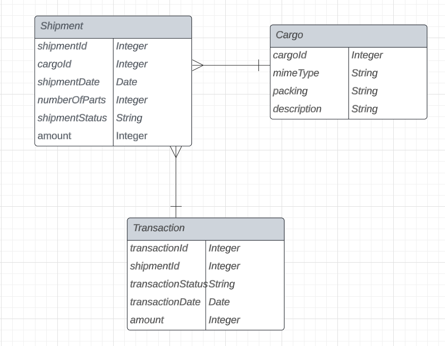
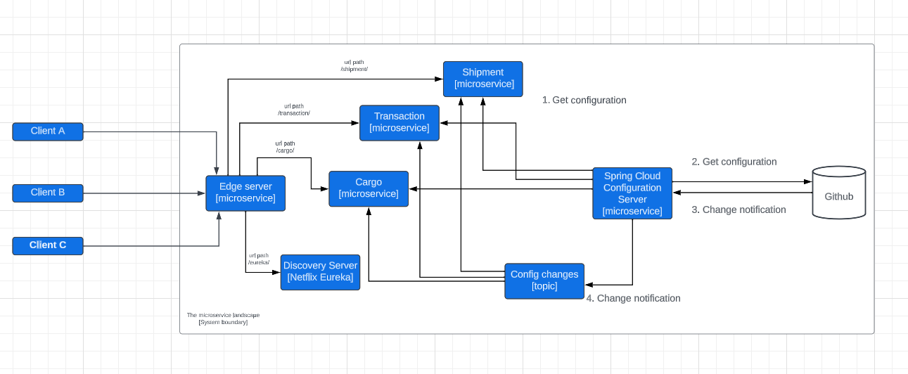

# dis-microservice

This project is shipment information service. It is a microservice architecture, implemented using Spring Boot and Spring Cloud. Business logic is presented through three microservices, where cargo, transaction and shipment microservices represent core microservices. Besides previously mentioned microservices, following Spring Cloud components were used:
* Spring Cloud Netflix Eureka - this component was used as Discovery Server. The Discovery Server is the key to the decentralized architecture. This is where routers, brokers and handlers announce themselves, and where you can look them up. 
* Spring Cloud Gateway - this component was used as Edge Server. The Gateway provides entry point to the microservice landscape, and it is used for routing to APIs and providing cross cutting concerns to them such as: security, monitoring/metrics etc.
* Spring Cloud Config - provides server and client-side support for externalized configuration in a distribudes system
* Resilience4j Circuit Breaker - helps us in preventing a cascade of failures when a remote service is down
* Resilience4j OpenFeign - makes it easy to incorporate "fault tolerance" patterns into feign framework, such as CircuitBreaker....

## Persistence

Data Persistence is implemented using one Database Management Systems. In shipment microservice landscape, there are three core microservices which require permanently data storing, and these microservices use following DBMSs:

* Cargo - PostgreSQL
* Transaction - PostgreSQL
* Shipment - PostgreSQL

The database schema is attached in the following picture, along with belonging attributes and data types.

The logic used for retrieving data for is call to other microservices. The core service is retriving data from other microservices using RestTemplate object in Spring Boot. The creation and retriving one shipment will return 
200 OK or 201 CREATED if successfully done, if not it will return a error.
## Microservice landscape

Microservice landscape is attached in the following image.

## Prerequisites

* ``Maven`` - download steps for installing Maven can be found here [here](https://maven.apache.org/install.html)
* ``Java`` - download steps for installing Java can be found here [here](https://www.java.com/en/download/)
* ``Docker`` and ``docker-compose`` - download steps for installing Docker Desktop can be found [here](https://docs.docker.com/desktop/)
* ``IntelliJ Idea`` - download steps for installing IntelliJ Idea can be found here [here](https://www.jetbrains.com/idea/download/?section=windows)

## Pipeline build/test/deploy
``docker compose up --build``
